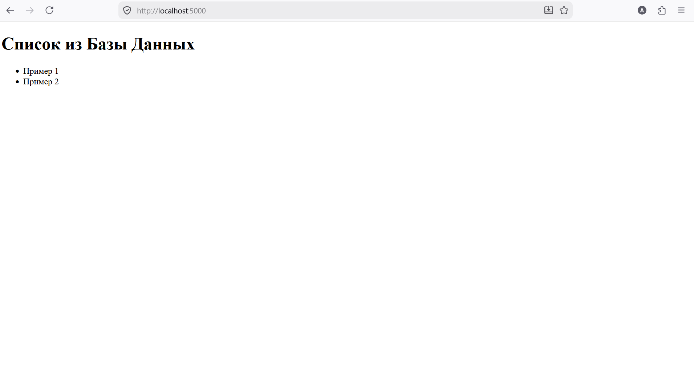

# Homework

## Laboratory 7

## Part 1

### Создание Dockerfile

```
FROM python:3.9-slim

WORKDIR /app

RUN apt-get update && apt-get install -y build-essential

COPY requirements.txt .

RUN pip install --no-cache-dir -r requirements.txt

COPY . .

EXPOSE 5000

CMD ["python", "app.py"]
```
### Сборка и запуск контейнера
```
cd app
docker build -t dock .

[+] Building 102.0s (11/11) FINISHED                                     docker:default
 => [internal] load build definition from Dockerfile                               0.9s
 => => transferring dockerfile: 334B                                               0.02s
 => [internal] load metadata for docker.io/library/python:3.9-slim                 1.3s
 => [internal] load .dockerignore                                                  0.0s
 => => transferring context: 2B                                                    0.0s
 => [1/6] FROM docker.io/library/python:3.9-slim@sha256:2d371e51b16d3038dbe0bf26ff53fc44995f755535eab1acdbee13c41731b1b1  9.1s
 => => resolve docker.io/library/python:3.9-slim@sha256:2d371e51b16d3038dbe0bf26ff53fc44995f755535eab1acdbee13c41731b1b1  0.01s
 => => sha256:3d3fd7101b0bbdba38318ea1dfd4ecfe1f64c14496bf253393abdc3c2ff7510b 10.36MB / 10.36MB  1.3s
 => => sha256:dad5b26e2566c35ee4f22273e14daef23d2f02f92fcc1717bbcf1d5339cca0eed 1.74kB / 1.74kB    0.0s
 => => sha256:d025b90ee18d94e754cb03dabecfe5ed33fcee944b0be0cf6cb2d2ebc1722d71 5.48kB / 5.48kB    0.0s
 => => sha256:96213bd7256913455a2d1039da2eaec8c3ff3bc7fa3ac2fc7cfd2cdbd131020d 29.20MB / 29.20MB  2.9s
 => => sha256:bd9c3f03b6e8cd3d80369796e64ec4aa00301dffedd4ae0aaa15b4bc7c30f30dd 1.25MB / 1.25MB    0.8s
 => => sha256:6cf344986a4221d6fe44d2845acdcbfd4ff33ec2da10bc02c89d713da1a2cb5f 13.08MB / 13.08MB  1.3s
 => => sha256:ee35fc9a35f5540fdff816823ef152d2cfebc1715b22ecc401c2cf450078215c 251B / 251B        1.2s
 => => extracting sha256:96213bd7256913455a2d1039da2eaec8c3ff3bc7fa3ac2fc7cfd2cdbd131020d          1.5s
 => => extracting sha256:bd9c3f03b6e8cd3d80369796e64ec4aa00301dffedd4ae0aaa15b4bc7c30f30dd          0.1s
 => => extracting sha256:6cf344986a4221d6fe44d2845acdcbfd4ff33ec2da10bc02c89d713da1a2cb5f          1.0s
 => => extracting sha256:ee35fc9a35f5540fdff816823ef152d2cfebc1715b22ecc401c2cf450078215c          0.0s
 => [internal] load build context                                                  0.0s
 => => transferring context: 2.88kB                                                0.0s
 => [2/6] WORKDIR /app                                                             0.2s
 => [3/6] RUN apt-get update && apt-get install -y build-essential                28.8s
 => [4/6] COPY requirements.txt .                                                  0.02s
 => [5/6] RUN pip install --no-cache-dir -r requirements.txt                      50.3s
 => [6/6] COPY . .                                                                 0.2s
 => exporting to image                                                             1.1s
 => => exporting layers                                                            1.1s
 => => writing image sha256:e208e065bc5225facc1ebca874866bad50fbced6f751ed1c3e301b179390aaa        0.0s
 => => naming to docker.io/library/dock                                            0.0s
```

```
sudo docker run --rm -it -p 5000:5000 dock

 * Serving Flask app 'app'
 * Debug mode: off
WARNING: This is a development server. Do not use it in a production deployment. Use a production WSGI server instead.
 * Running on all addresses (0.0.0.0)
 * Running on http://127.0.0.1:5000
 * Running on http://172.17.0.2:5000
Press CTRL+C to quit
Error: 2003 (HY000): Can't connect to MySQL server on 'localhost:3306' (111)
10.0.2.2 - - [31/May/2026 15:37:01] "GET / HTTP/1.1" 200 -
```

### Копирование файла в контейнер и проверка выполнения команды

```
sudo docker ps

CONTAINER ID   IMAGE     COMMAND           CREATED              STATUS              PORTS                                       NAMES
e7a7b889476a   dock      "python app.py"   About a minute ago   Up About a minute   0.0.0.0:5000->5000/tcp, :::5000->5000/tcp   charming_bose
```

```
sudo docker cp README.md e7a7b889476a:/home/README.md

sudo docker exec -it e7a7b889476a bash

ls /home/
README.md
```

### Остановка контейнера
```
exit
^C
```

## Part 2

### Создание docker-compose.yml
```
services:
    app:
        build: ./app
        container_name: docker_app
        ports:
            - "5000:5000"
        depends_on:
            db:
                condition: service_healthy
        environment:
            - DB_HOST=${DB_HOST}
            - DB_USER=${DB_USER}
            - DB_PASS=${DB_PASS}
            - DB_NAME=${DB_NAME}
    db:
        image: mysql:8.0
        container_name: mysql_db
        restart: unless-stopped
        env_file: .env
        environment:
            MYSQL_ROOT_PASSWORD=${DB_ROOT_PASSWORD}
            MYSQL_DATABASE=${DB_NAME}
            MYSQL_USER=${DB_USER}
            MYSQL_PASSWORD=${DB_PASS}
        volumes:
            - db_data:/var/lib/mysql
            - ./db/init.sql:/docker-entrypoint-initdb.d/init.sql
        healthcheck:
            test: ["CMD", "mysqladmin", "ping", "-h", "localhost"]
            interval: 10s
            timeout: 5s
            retries: 3
volumes:
    db_data:
```

### Запуск

```
docker compose up --build

 * Serving Flask app 'app'
 * Debug mode: off
WARNING: This is a development server. Do not use it in a production deployment. Use a production WSGI server instead.
 * Running on all addresses (0.0.0.0)
 * Running on http://127.0.0.1:5000
 * Running on http://172.24.0.3:5000
Press CTRL+C to quit
10.0.2.2 - - [01/Jun/2026 09:34:20] "GET / HTTP/1.1" 200 -
```

##
